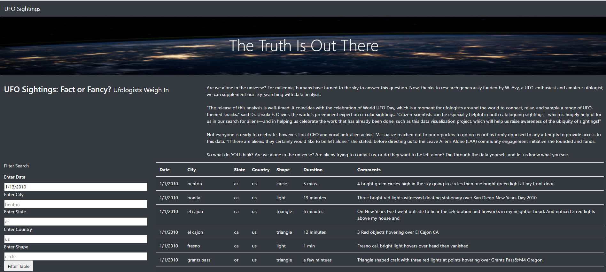
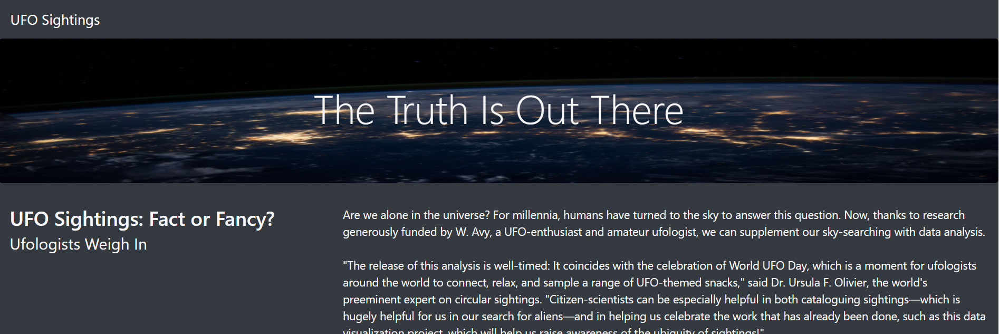
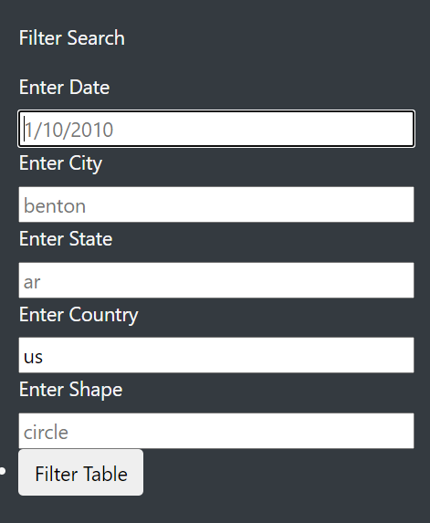

# UFOs
## Overview of the analysis:
The purpose of this project is to use JavaScript, HTML, and CSS to create a custom webpage that showcases different UFO sightings around the world.
To be specific, we use HTML to create webpages that includes dynamic table with filters to filter the data by Data, City, State, Country, and Shape. Meanwhile, the webpage also include image and UFO paragraphs to can provide more UFO sightings for us.

## Results:
### Webpage Overview:

### UFO Introduction:

### Filter Search:

We can entered all the criteria that we want to know into the blank box below to efficiently get information about UFOs from websites.

## Summary:
One drawback is the "Filter Table" button is next to "Enter Shapte" filter, looks like crowded in that area.
Two additional recomendations are 1).Add a "clear button" below to the "Filter Table" button to help us clear all the criteria for the next time filter. 2).Add a link of video about what public see of the UFOs and their views.
